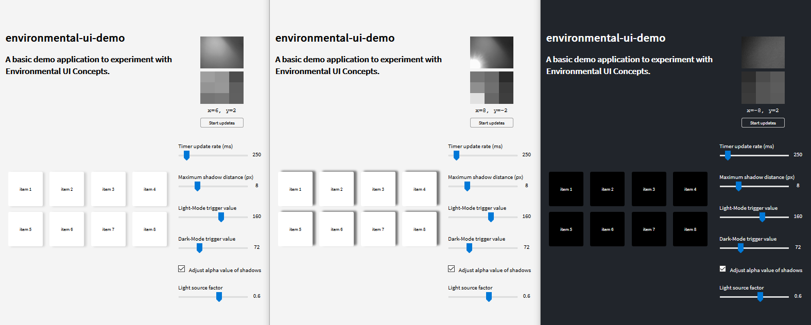

# environmental-ui-demo

    

## Quick start

Choose one of the following options:

- Clone the git repository - `git clone https://github.com/mysliwietzflorian/environmental-ui-demo.git`.
- Navigate to server directory - `cd environmental-ui-demo/server`.
- Install dependencies - `npm install`.
- Start the server - `npm start`.
- Browse to `https://localhost` to view the static website. (Use HTTPS)
    - **Alternatively**: Use external IP address listed in server CLI to connect from a different device (other PC or mobile device) in the same network (e.g. `192.168.1.10`).

## Dependencies

### Server
- express (^4.17.1)
- os (^0.1.1)

### Client
- jQuery (3.4.1)
- bootstrap grid (4.3.1)
- fonts.googleapis: `Source Sans Pro`

## Further Reading

- [The Environmental User Interface: A Quantum Leap Forward](https://bobburrough.com/public/post/environmentally_lit_interface_a_quantum_leap_forward/)
