# environmental-ui-demo (implementation details)

## Table of contents

- [environmental-ui-demo (implementation details)](#environmental-ui-demo-implementation-details)
    - [Project structure](#project-structure)
    - [Camera/Webcam](#camerawebcam)
    - [Preprocessing](#preprocessing)
        - [Mirror image](#mirror-image)
        - [Grayscale filter](#grayscale-filter)
        - [Region averages](#region-averages)
        - [Brightness gradient](#brightness-gradient)
    - [Update loop](#update-loop)
    - [Shadow properties](#shadow-properties)
    - [Dark Mode](#dark-mode)
    - [Soft and hard shadows](#soft-and-hard-shadows)
    - [Criticism of environmental UI concepts](#criticism-of-environmental-ui-concepts)
    - [Known problems for this demo](#known-problems-for-this-demo)

## Project structure

The project consists of two different components: a server and a client component. The server serves static client files via HTTPS protocol while the client contains the main logic of the application.

The whole business logic is mainly written in these three files:
- index.html
- style.css
- main.js

```
environmental-ui-demo
│   .gitignore
│   LICENSE
│   README.md
├───client
│   └───public
│       │   index.html
│       ├───css
│       │       main.css
│       │       normalize.css
│       │       style.css
│       └───js
│           │   main.js
│           │   plugins.js
│           └───vendor
│                   jquery_3.4.1.js
└───doc
        implementation.md
└───server
        index.js
        package.json
        server.cert
        server.key

```

## Camera/Webcam

This application makes use of the user camera or webcam with [`Navigator.mediaDevices`](https://developer.mozilla.org/en-US/docs/Web/API/Navigator/mediaDevices). All modern browsers require user interaction to allow access to these devices.

> First, getUserMedia() must always get user permission before opening any media gathering input such as a webcam or microphone.  
>
> *(Extract from [MDN - MediaDevices.getUserMedia()#User_privacy](https://developer.mozilla.org/en-US/docs/Web/API/MediaDevices/getUserMedia#User_privacy))*

Moreover, the files are served via HTTPS and a self-signed certificate to ensure a secure context for the media devices. Otherwise, (especially on mobile platforms) the camera cannot be accessed correctly. The provided certificate files MUST NOT be used in a production environment.

> The getUserMedia() method is only available in secure contexts. A secure context is one the browser is reasonably confident contains a document which was loaded securely, using HTTPS/TLS, and has limited exposure to insecure contexts. If a document isn't loaded in a secure context, the navigator.mediaDevices property is undefined, making access to getUserMedia() impossible.  
>
> *(Extract from [MDN - MediaDevices.getUserMedia()#Encryption_based_security](https://developer.mozilla.org/en-US/docs/Web/API/MediaDevices/getUserMedia#Encryption_based_security))*

## Preprocessing

As soon as the user grants permissions to use the camera device, a stream is captured in a HTMLVideoElement. Furthermore, a canvas element draws periodically an image from the video and applies the following preprocessing to it:

- Mirror the input image
- Transform to grayscale colors
- Calculate region averages for 9 regions (3x3 matrix)
- Calculate middle brightness gradient for these regions

### Mirror image

The mirroring effect is achieved with the scaling method of the canvas element. For further information take a look at the [MDN-Documentation](https://developer.mozilla.org/de/docs/Web/API/CanvasRenderingContext2D/scale).

This transformation is applied in order to appear like a normal front camera instead of a rotated view of the scene. Therefore, the calculations later become easier and more readable and the user is not confused with this behavior.

### Grayscale filter

Only brightness values of the source image are necessary for this application. To calculate these the [luminosity method](https://en.wikipedia.org/wiki/Grayscale#Converting_color_to_grayscale) is used.

### Region averages

The image is split into 9 equal-sized regions, 3 in horizontal and 3 in vertical direction. Within these regions an average-filter is applied: The average of all grayscale values in a region is calculated and written to a 1-dimensional array. This array is used in multiple ways:

- to display these regions in a canvas element
- to calculate the initial ratio of x- and y-direction for the shadow offsets
- to toggle Dark Mode based on the maximum brightness value of one region
- to adjust softness level of the shadows

### Brightness gradient

The brightness gradient uses the region averages calculated before and is the basis for the offsets of the shadows. These two values in x- and y-direction are normalized, scaled for the camera format and rounded before eventually applying them to the UI-elements.

The Sobel operator in x- and y-direction is the underlying idea for the gradients. The convolution is only applied on the center region with the 8 surrounding neighbors.

The following illustrations display different processing results. The first line contains the initially calculated gradient values while the second line present the resulting applied offsets.

<p align="center">
    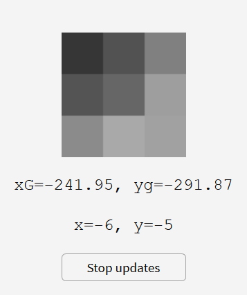
    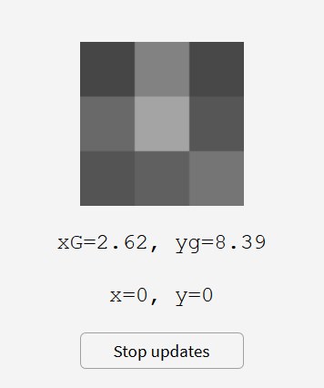
    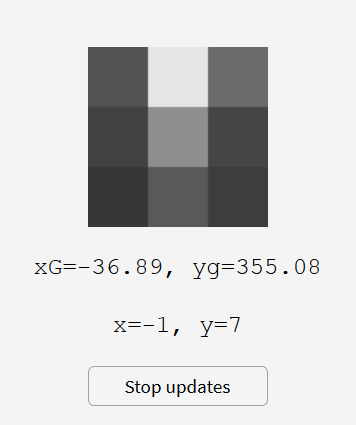
    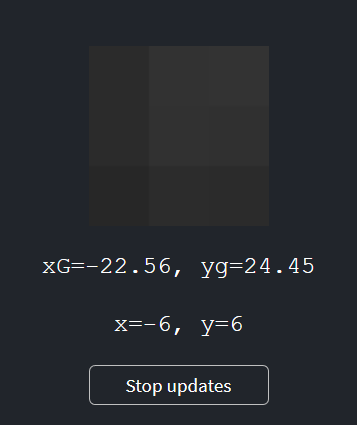
</p>

> *Figure 1.* The proportions between initial gradient and applied pixel offsets might not be completely consistent: Values will be rounded and most of the time scaled in one dimension as a result of the format of the end-user's camera.

&nbsp;
&nbsp;
&nbsp;

While the directions of the shadows are the first step for the actual pixel offsets of the UI-elements, some modifications have to be made to accurately predict the direction of the light sources in the real world. The most important of these modifications is the scaling of the x- and y-offsets based on the format of the end-user's camera. Simply adjusting the proportions of the offsets to fit the ratio of the video dimension helps in providing correct results.

## Update loop

A user can define the update rate of the shadows with the slider "**Timer update rate**". Every interval of this value an image from the video stream is captured and the update procedure is executed. With the button "Stop updates" the user can toggle the execution of said updates.

The update loop is powered by the [`setInterval()`](https://developer.mozilla.org/en-US/docs/Web/API/WindowOrWorkerGlobalScope/setInterval) and [`clearInterval()`](https://developer.mozilla.org/en-US/docs/Web/API/WindowOrWorkerGlobalScope/clearInterval) methods of the `WindowOrWorkerGlobalScope`.

Noteworthy is, that the actual redrawing of the shadow only happens if the pixel offsets of the shadows change in comparison to the frames before and the application is not in Dark Mode.

## Shadow properties

The shadow created for UI-elements can be defined with a few simple variables. While we have already covered shadow offsets from the gradients (more or less the direction of the shadows) the effective distances in pixels still leave some explanation open.

Here two variables come into play:
- `maxShadowDistance` defines the maximum amount of pixels the shadow can be away from the inner UI-element.
- `maxExtension` is a quantity for the number calculated in the gradient value that complies with the maximum distance for the result. All gradients bigger than `maxExtension` will have a distance of `maxShadowDistance` pixels from the UI-elements.

Therefore, the initial gradient offsets will be normalized using the following process:

- Convert the gradient offset coordinates (x and y) to polar coordinates (distance, angle).
- Limit the gradient distance to `maxExtension`.
- Linear interpolate the gradient distance to a value between 0 and `maxShadowDistance`. The result is the distance for the pixel offsets from the UI-elements.
- Convert the pixel distance and the gradient angle back to the resulting cartesian pixel offsets.
- Lastly, the offsets will be rounded to the nearest integer.

The slider "**Maximum shadow distance**" adjusts the shadow's coordinates for all UI-elements.

## Dark Mode

Dark Mode shall be utilized automatically if the space around the user is not well lit. This does not mean that the UI-elements are just dark and one would need an external light to read and understand the UI, but rather the eyes should not be exposed to a lot of bright light from the display. To be able to see the elements in a natural way specific parts of the UI (like the font) can be made self-luminous to be legible.

This behavior can be compared to a skyline of a town:
- As the sunlight shines all buildings can be seen perfectly.
- At dusk the light will be less and less intense while structures are still well defined.
- At nightfall street lanterns and the lights in the windows will be visible and as a result, the skyline is still perceptible. The view changes in a way that the end-user can predict.

That is why Dark Mode is triggered when all regions of the current frame fall below a defined threshold. That value can be manipulated with the slider "**Dark-Mode trigger value**". To have a stable color theme on environments with small or frequent changes of light the value to trigger Light Mode again should be set higher than the other threshold and can be adjusted with the slider "**Light-Mode trigger value**". If the values of either slider is set to the corresponding extreme, a color theme can be established permanently without changing other logic.

### Soft and hard shadows

As described in the Wikipedia article about [hard and soft light](https://en.wikipedia.org/wiki/Hard_and_soft_light) the following aspects about shading can be said:

> The hardness or softness of light depends mostly on the following two factors:
> - Distance. The closer the light source, the softer it becomes.  
> - Size of light source. The larger the source, the softer it becomes.  
>
>*(Extract from [Wikipedia - Hard and soft light](https://en.wikipedia.org/wiki/Hard_and_soft_light))*

From the input data alone the application cannot directly find information about the distance of the light source, so this part is not applied here.
However, we can take a guess at the size of a light source by counting regions which are reasonable well lit, e.g. have a high enough grayscale value. This threshold is defined by a fixed percentage of the maximum brightness. The more sources are found, the softer the shadows should be and, consequently, the lower the alpha value must be. This proportion is not implemented linearly but leans to the softer shadows for visual appearance reasons.

The usage of variable shadow softness can be user-toggled with the checkbox "**Adjust alpha value of shadows**". If disabled, the alpha value of the shadow will be constant. On the other hand, if that feature is enabled the number of light sources based on the average regions (1 to 9 light sources are possible) will be extracted. A region will be recognized as a light source if the value of that region is at least `lightSourceFactor`% of the region with the maximum brightness. That variable can be adjusted with the slider "**Light source factor**".

## Criticism of environmental UI concepts

**Performance** - The biggest problem with this kind of UI concept has to do with performance issues on low-end devices. As the video stream needs to be analyzed and processed and - probably even more severe - the shadow draw calls are repeated many times (often several per second) the performance will be the bottleneck for widespread web and native utilization of this concept.

**Battery life** - As a lot of energy is used to drive this kind of user interface the battery of mobile devices will suffer massively. Another side effect is that the device can get quite hot over time and in extreme cases damage it permanently.

**Privacy** - The application needs user permissions to access the camera and at the moment no security system prevents an UI library to use streamed video data for a different purpose. Maybe in the future an operating system could provide information directly about the surrounding light sources in order to act against this problem.

**Hardware** - Currently, no mobile device would be able to work extensively good with that kind of UI. The battery consumption is way too high and the device would have to be fitted with a camera capable of capturing a greater angle of the view. Both of these problems could be conquered if manufacturers saw a potential for a market within these technologies.

**Benefits** - What are the real benefits of such a user interface? This question could also be applied to our modern UI design systems in general and one answer could be to increase the expressiveness of a creative designer. Moreover, any visual quality including glitter, reflection, translucency, carbon fiber, pearlescence, iridescence, decalescence, illumination, or other interesting material properties can be depicted [[1]](https://bobburrough.com/public/post/surely_you_cant_be_serious_bob/#do-we-really-need-this-how-is-this-useful).

Another argument for this kind of UI can be the natural changing between Dark and Light Mode. Instead of defining night filters manually or time-based this concept can help to prevent problems with other options. Consider the following situations:

- The device switches automatically (time-based) to Dark Mode, although, the user sits in a well-lit room and has no needs for a night filter.

- The user sits in a dark room and wants to respond to a message. As it is still daytime the device will be in Light Mode and shine directly in the face of the user.

While environmentally lit UI can solve these problems partly, they are definitely still prone to some errors. In these circumstances a manual switch to Dark or Light Mode should always be provided to a user.

## Known problems for this demo

- [ ] Webcam on iOS-devices seems to be stuck.

- [ ] Disabling the slider elements (`<input type="range" disabled>`) is not displayed correctly. This is important for the slider "**Light source factor**".

- [ ] The direction of light sources cannot always be determined precisely. One problem might occur if the light source is outside of the camera view. It might shine on an object in frame and trigger that element as light source.

- [ ] The quality of the demo highly depends on the angle of the camera frame. If the view angle is greater, then the probability that the light source is captured in frame gets bigger.

- [ ] If multiple light sources are recognized (true or reflective sources) the direction and the intensity can be completely wrong.

- [ ] As light intensity in captured videos change abruptly, camera's sensitivities tend to automatically adjust to a certain degree. These modifications have a negative impact on the calculations of the intensity shadows.

## Demonstration

<p align="center">
    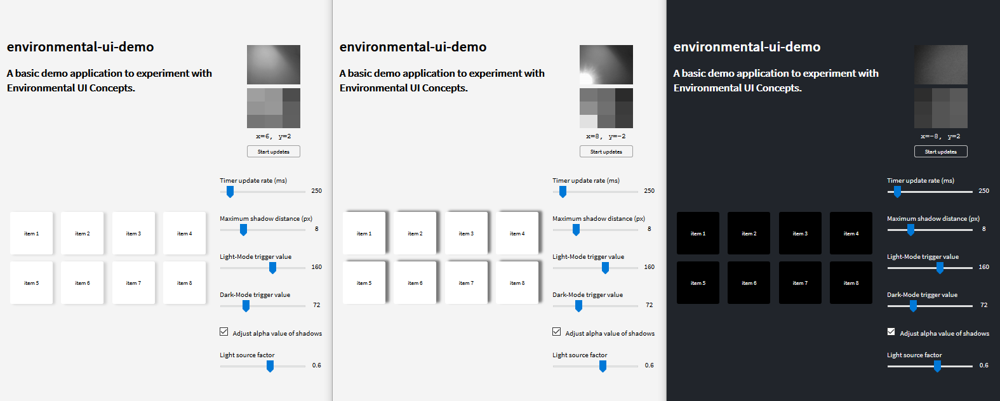
</p>

> *Figure 2.* Basic use case of the application. In all three examples the adjustable parameters stay constant. Between illustration (A) and (B), the general direction of the light source stays the same, however, the intensity changes. As a result, the shadows in illustration (B) are harder. As the brightness decreased to a defined threshold, Dark Mode is applied to all UI-elements and the shadows disappear.

&nbsp;
&nbsp;
&nbsp;

<p align="center">
    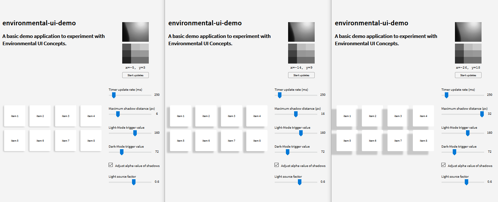
</p>

> *Figure 3.* Demonstration of a change in the slider "**Maximum shadow distance**".

&nbsp;
&nbsp;
&nbsp;

<p align="center">
    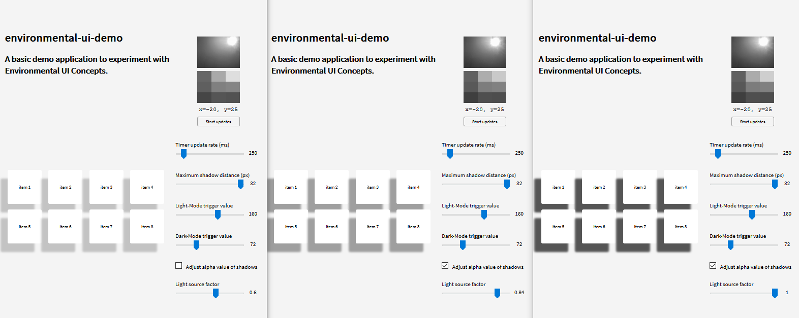
</p>

> *Figure 4.* Demonstration of the adjusting intensity of shadows. In illustration (A) the alpha value stays constant and regional changes are disregarded. Illustration (B) can be distinguished from (C) by the slider "**Light source factor**". Here the factor to differentiate a light source based on the maximum brightness region is changed.

&nbsp;
&nbsp;
&nbsp;

<p align="center">
    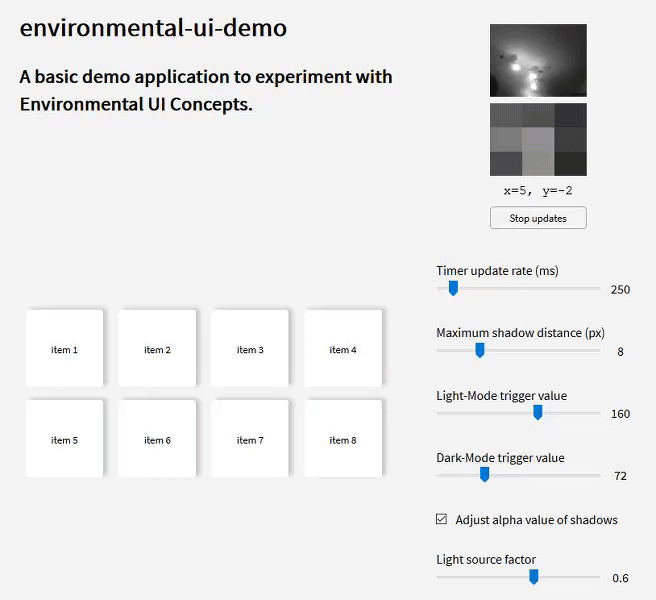
</p>

> *Figure 5.* Animated demonstration of changing light directions and Dark Mode.

&nbsp;
&nbsp;
&nbsp;

<p align="center">
    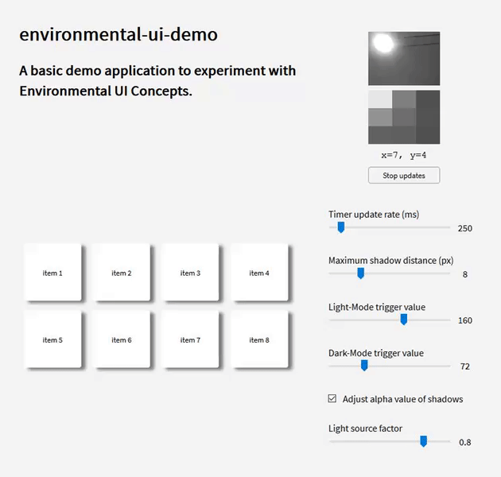
</p>

> *Figure 6.* Animated demonstration of adjusting maximum shadow distance.

&nbsp;
&nbsp;
&nbsp;

<p align="center">
    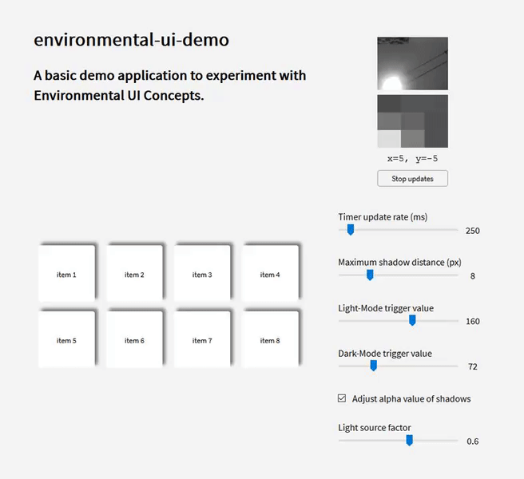
</p>

> *Figure 7.* Animated demonstration of timer update rate.

&nbsp;
&nbsp;
&nbsp;

<p align="center">
    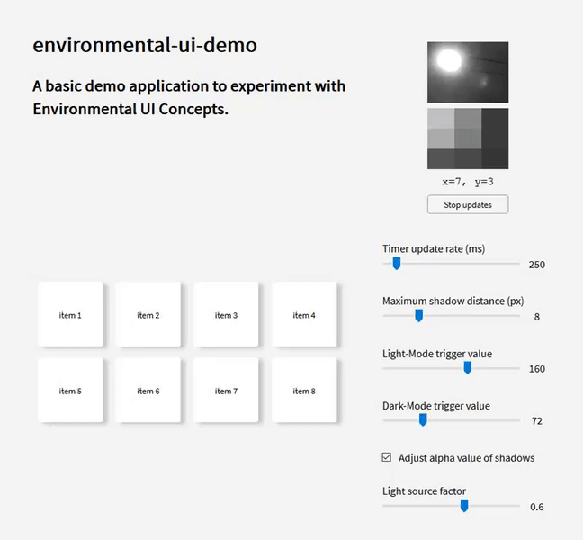
</p>

> *Figure 8.* Animated demonstration of shadow intensity.

&nbsp;
&nbsp;
&nbsp;

<p align="center">
    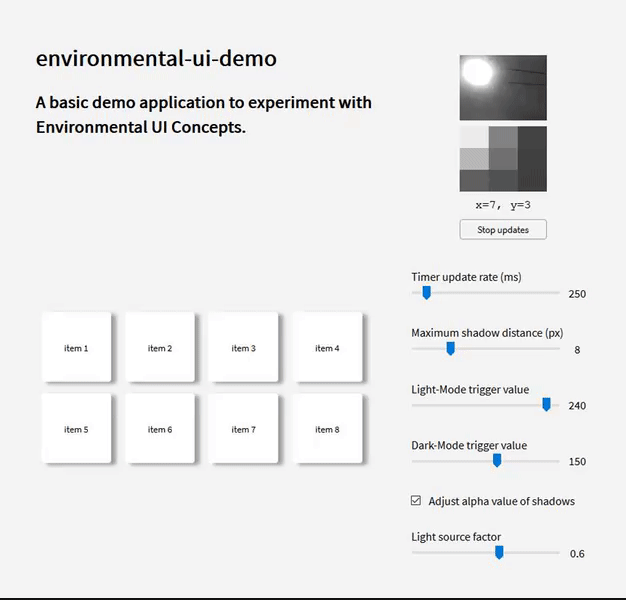
</p>

> *Figure 9.* Animated demonstration of Dark Mode trigger.

&nbsp;
&nbsp;
&nbsp;

## Further research topics

- Use all available camera devices, e.g. front- and back-camera on mobile.

&nbsp;

- Instead of dividing images in average regions to find light sources, use a region growing approach. In this way, the application can make use of
    - multiple light source directions by extracting the centroid of a region (multiple shadows based on the different sources would be possible),
    - the dimension and luminance of the light sources
    - the color of the light sources

&nbsp;

- At the moment, pixel offsets for shadows are used. Alternatively, the angle from the surface normal of the display in x- and y-direction can be provided. This would enhance the implementation of other demonstrations like reflections as well as nacre-effects or carbon-effects.

&nbsp;

- While using different Dark- and Light-Mode triggers seem like a good idea, it is more intuitive to use a base threshold value and a jitter value for the border area.  
E.g. Change from  
`darkModeTrigger = 72, lightModeTrigger = 160` to  
`darkModeTrigger = 116, jitterArea = 88`.

&nbsp;

- Add further demonstrations of environmental UI concepts. Examples could be reflections or carbon effects.

&nbsp;

- In the first place, environmental UI focuses on the illumination of UI-elements. Supplementary, other senses from the environment can be included. First, the use of audio signals (such as the sound of wind to move elements in the UI) can be an inspiration. Second, direct user interaction with the camera like in motion sensing input devices (e.g.: Microsoft Kinect) combined with UI-elements is an interesting aspect worth exploring. Lastly, the use of eye tracking can be applied to interact with UI-elements (cf. tooltips on hover).
